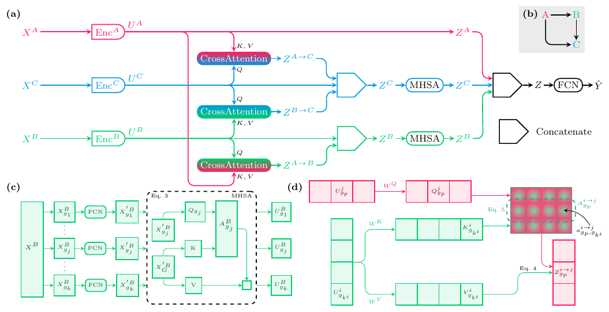

# CrossAttOmics: Multi-Omics data integration with CrossAttention



## Abstract

Advances in high throughput technologies enabled large access to various types of omics. Each omics provides a partial view of the underlying biological process. Integrating multiple omics layers would help have a more accurate diagnosis. However, the complexity of omics data requires approaches that can capture complex relationships. One way to accomplish this is by exploiting the known regulatory links between the different omics, which could help in constructing a better multimodal representation.

In this article, we propose CrossAttOmics, a new deep-learning architecture based on the cross-attention mechanism for multi-omics integration. Each modality is projected in a lower dimensional space with its specific encoder. Interactions between modalities are computed in the feature space with cross-attention. Instead of computing the interactions between all the modality pairs, we focused on the known regulatory links between the different omics. The results of different experiments carried out in this paper show that our model can accurately predict the types of cancer by exploiting the interactions between multiple modalities. Our approach can be combined with attribution methods like LRP to identify which interactions are the most important.

## Setup your environment

We used python 3.10.11.
In a virtual environment run the following command:

```bash
pip install -r requirements.txt
```

## Download TCGA and CCLE data

TCGA data can be downloaded from the [TCGA data portal](https://portal.gdc.cancer.gov/).
CCLE data can be downloaded from the [DepMap portal](https://depmap.org/portal/ccle/).

## Prepare your data

Omics files contain the expression matrix of the different patient. Each row represents a patient and each columns represents the different features.

Each data batch must be a dictionnary `dict[str, Tensor]`, where the key is the name of the modality, and the value the corresponding data tensor.

```python
batch = {"mRNA": X_mrna, "DNAm": X_dnam}
```

Here is an example of a dataset that can be used with data stored in a [`.npz`](https://numpy.org/doc/stable/reference/generated/numpy.savez.html) file:

```python
from torch.utils.data import Dataset

class MultiOmicsDataset(Dataset):
    def __init__(self, data_path, omics):
        data = np.load(data_path)
        assert all([omic in data.files for omics in omics])
        self.omics = omics
    
    def __len__(self):
        return next(iter(data.values())).shape[0]

    def __getitem__(self, index):
        if torch.is_tensor(index):
            index = index.tolist()

        return {omic: torch.from_numpy(data[omic][index, :]) for omic in self.omics}, torch.from_numpy(data["label"][index])
```

## Create your model

To create a new instance of a CrossAttOmics model, different components must be created.

1. Modalities encoders

```python
modalities_encoder = {
    "mRNA": AttOmicsEncoder(
        in_features=19887,
        n_group=20,
        group_size_list=[758, 522, 286, 50],
        num_heads=1,
        flatten_output=False,
    ),
    "DNAm": AttOmicsEncoder(
        in_features=14197,
        n_group=10,
        group_size_list=[979, 539, 100],
        num_heads=1,
        flatten_output=False,
    )
}
```

2. Modalities fusion module

An important information for the fusion module is the interaction graph that defines how the modalities interacts. The interaction graph is a dictionnary `dict[str, list[str]]`, where the key represents the target modality, and the value is a list that contains the different modalities (source modalities) that interact with the target modality.

```python
interaction_graph = {"mRNA": ["DNAm"]}
```

Then we also need to create the different `CrossAttention` modules. There is a `CrossAttention` for each interaction in the graph. In this case there is only one `CrossAttention`. The different `CrossAttention` modules are stored in a dictionnary, where the key represents the interaction that is computed with this `CrossAttention`: `"source-_-target"`. The `embed_dim`, `k_dim` and `v_dim` parameters correspond to the size of a group after being encoded with `AttOmicsEncoder`. `embed_dim` corresponds to the group size of the target modality. `k_dim` and `v_dim` correspond to the group size of the source modality.

```python
cross_attention = {
    "DNAm-_-mRNA": CrossAttentionBlock(
        embed_dim=50, num_heads=1, k_dim=100, v_dim=100
    )
}
```

The fusion module `OmicsInteraction` is then defined as follow:

```python
fusion = OmicsInteraction(
    omics=omics,
    interaction_graph=interaction_graph,
    cross_attention_blocks=cross_attention,
    add_unimodal_branches=True,
    add_unimodal_to_multimodal=False,
)
```

3. Multimodal encoder

The fusion module outputs a single `Tensor` that is passed to the `multimodal_encoder` to compute global interaction between modalities. This module is a `FullyConnectedNetwork`.

```python
multimodal_encoder = FullyConnectedNetwork(
    [
        FullyConnectedLayer(input_dim=2000, output_dim=1400),
        FullyConnectedLayer(input_dim=1400, output_dim=700),
        FullyConnectedLayer(input_dim=700, output_dim=100),
    ]
)
```

Finally, all the elements to create a `CrossAttOmics`model are in place.

```python
model = CrossAttOmics(
    num_classes=18,
    modalities_encoders=modalities_encoder,
    fusion=fusion,
    multimodal_encoder=multimodal_encoder,
)
```

## Train your model

```python
training_loader = DataLoader(train_dataset, batch_size=256, suffle=True)
device = torch.device("cuda:0")
loss_fn = nn.CrossEntropyLoss()
optimizer = SGD(model.parameters, lr=0.001, momentum=0.9)

for _ in range(num_epochs):
    for batch in training_loader:
        inputs, labels = batch
        inputs = {k, v.to(device) for k,v in inputs.items()}
        labels = labels.to(device)
        
        optimizer.zero_grad(set_to_none=True)
        preds = model(inputs)
        loss = loss_fn(preds, labels)
        loss.backward()
        optimizer.step()
```


## Measure the importance of the omics interaction

See the [Interactions Importances notebook](./LRP_CrossAttOmics.ipynb).

## Citation

```bibtex
@article{CrossAttOmics,
  title = {CrossAttOmics: Multi-Omics data integration with CrossAttention},
  author = {Beaude,  Aurélien and Augé,  Franck and Zehraoui,  Farida and Hanczar,  Blaise},
}
```
